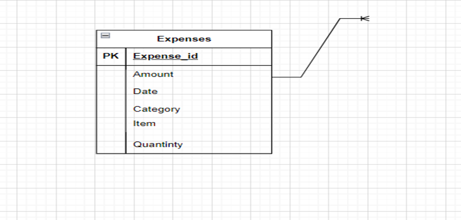

Sisipho Gwama 		Database Assignment 1
Part 1
Question 1. Research

1.1	SQL is a language that is used to communicate to a database which is behind the scenes. Firstly, the product information is stored the database a SQL plays a role into fetching that information and show it to a customer when they browses the store e.g. the product size, price and quantity.  Online stores people can create their user accounts, so the SQL plays a role of inserting those new users into database tables and also to insert new order details when customers place their orders.
1.2	The SQL is a play a crucial role in the web application as it enables the developers to perform operations such as querying data, updating the records, deleting the recording and creating new records. By using the SQL in web applications, you can handle the user inputs and ensure data integrity and security.
1.3	Data Collection, Data Retrieval and Data organization & manipulation.
1.4	-Data efficiency, can access data and perform complex processes quickly, enabling fast data processing and handling large volume of data.
-Data organization, it’s a capability to organize the data using database tables and relationships which ensure the data is consistent and make it easy to manage.
- Data retrieval, it allows the quick and accurate access to the stored information which is crucial for making business decisions.

1.5	Microsoft SQL Server, MySQL and PostgreSQL

Part 2: Database Fundamentals
Question 2.1 Tables
Database table just like a spreadsheet is a structured collection of data organized in rows and columns where the rows have records and columns represents fields. This is similar as data is stored in a table format allowing easy data entry and retrieval, each dedicated to a specific subject.
Question 2.2 Columns
Column is the vertical division of a table format like labels on library shelves that categorises the data and holds a specific type of data such as Numbers, dates or text.
Data types are important in a database because they define the kind of data to be stored in each column and they ensure the data consistency and accuracy.  3 common data types:
-Text, is used to store alphanumeric characters for example names or description.
-Number, is used to store numeric values essential for calculations and measurements, this have different types can be integer or double.
-Date, this is used to store date and time.

Question 2.2 Data types
- Data types are important in a database because they define the kind of data to be stored in each column and they ensure the data consistency and accuracy.  3 common data types:
-Text, is used to store alphanumeric characters for example names or description.
-Number, is used to store numeric values essential for calculations and measurements, this have different types can be integer or double.
-Date, this is used to store date and time.

Part 3: Expense Tracker Database Design
3.1 Planning 
To build Expense Tracker Application here are the data points: 
-Date
-Text
-Number

3.2 Tables
Table: Expenses

Columns:
Expense_id	int(11) AI PK
Amount	decimal(255)
Date	date()
Category	int(11)
Item	varchar(50)
Quantity	int(11)

 
